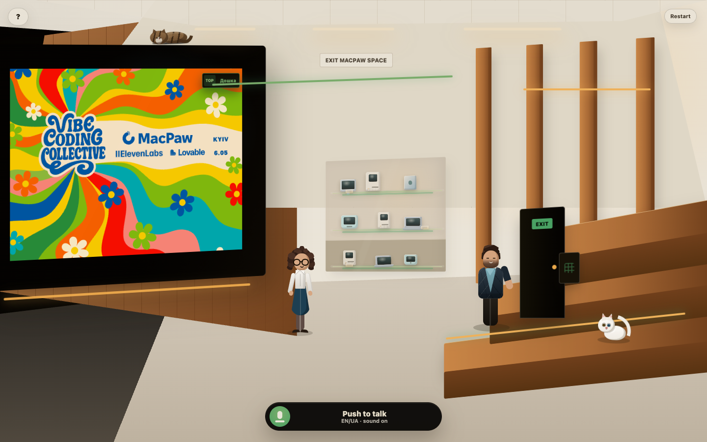
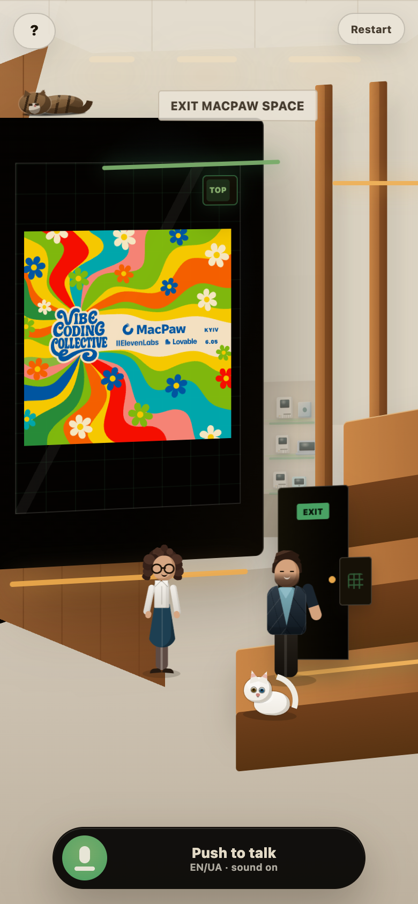

# Exit MacPaw Space

**A voice-first escape room built with AI agents, ElevenLabs, and a small
MacPaw Space-inspired world.**

The player is locked inside a simplified MacPaw Space after a vibe-coding event
and has to find the exit code by speaking to the right characters in the right
way. The interaction is intentionally voice-first: who the player addresses
matters, the room state changes through voice turns, and spoken replies close
the loop when provider credentials are configured.

The idea was born during an ElevenLabs event. The first playable loop was built
there, then continued as a pet project and shaped into a fuller desktop and
mobile demo.

<p align="center">
  
</p>

<p align="center">
  
</p>

## What It Is

- A short browser-based escape room.
- Voice-first player input with minimal UI.
- A compact cast: Sofiia, Dan, Hoover, and Fixel.
- A MacPaw Space-inspired room with a small Mac museum reference.
- Ukrainian and English play without an in-room language selector.
- Server-side AI provider calls so API keys never ship to the browser.

## Live Demo

Public URL: [exit-macpaw-space.mykyyta.link](https://exit-macpaw-space.mykyyta.link/)

The public demo is designed to run through the browser-facing
CloudFront/custom-domain entrypoint with the Express API behind the same origin.
Voice play, generated replies, text-to-speech, and leaderboard features depend
on the production backend and configured provider credentials.

## Stack

- TypeScript
- Vite + React
- Node.js + Express
- Claude-compatible text generation behind the server boundary
- ElevenLabs STT/TTS paths when configured
- Optional DynamoDB-backed leaderboard storage

## Run Locally

```bash
npm install
cp .env.example .env
npm run dev
```

Default local URLs:

- UI: `http://localhost:3000`
- API: `http://localhost:8787`

The app can run locally without paid provider keys, but the richest voice path
needs server-side environment variables in `.env`. Keep real values local or in
platform secrets only.

Useful checks:

```bash
npm run typecheck
npm run test:quest
npm run build
```

## Environment

`.env.example` documents the supported variables. Common local values include:

- `CLAUDE_API_KEY` and `CLAUDE_MODEL` for server-side Claude replies.
- `ELEVENLABS_API_KEY` and `ELEVENLABS_STT_MODEL` for ElevenLabs speech paths.
- `LEADERBOARD_TABLE_NAME` and `LEADERBOARD_COMPLETION_TOKEN_SECRET` for
  persistent leaderboard storage.
- `SERVER_PORT` for the Express API port.

Do not commit `.env`, provider keys, AWS credentials, Railway tokens, or MCP
server tokens.

## Project Docs

- `docs/product/product.md` is the product source of truth.
- `docs/readme.md` indexes the documentation system.
- `docs/build-system/architecture/stack.md` records the stack and contracts.
- `docs/build-system/integrations/cloud-deployment.md` records the cloud path.
- `docs/build-system/integrations/elevenlabs-mcp.md` explains the ElevenLabs MCP
  setup.
- `AGENTS.md` and `CLAUDE.md` define agent workflow rules.

## Security

Do not open public issues containing secrets, API keys, tokens, credentials, or
private infrastructure details. See `SECURITY.md`.

## License

MIT. See `LICENSE`.
